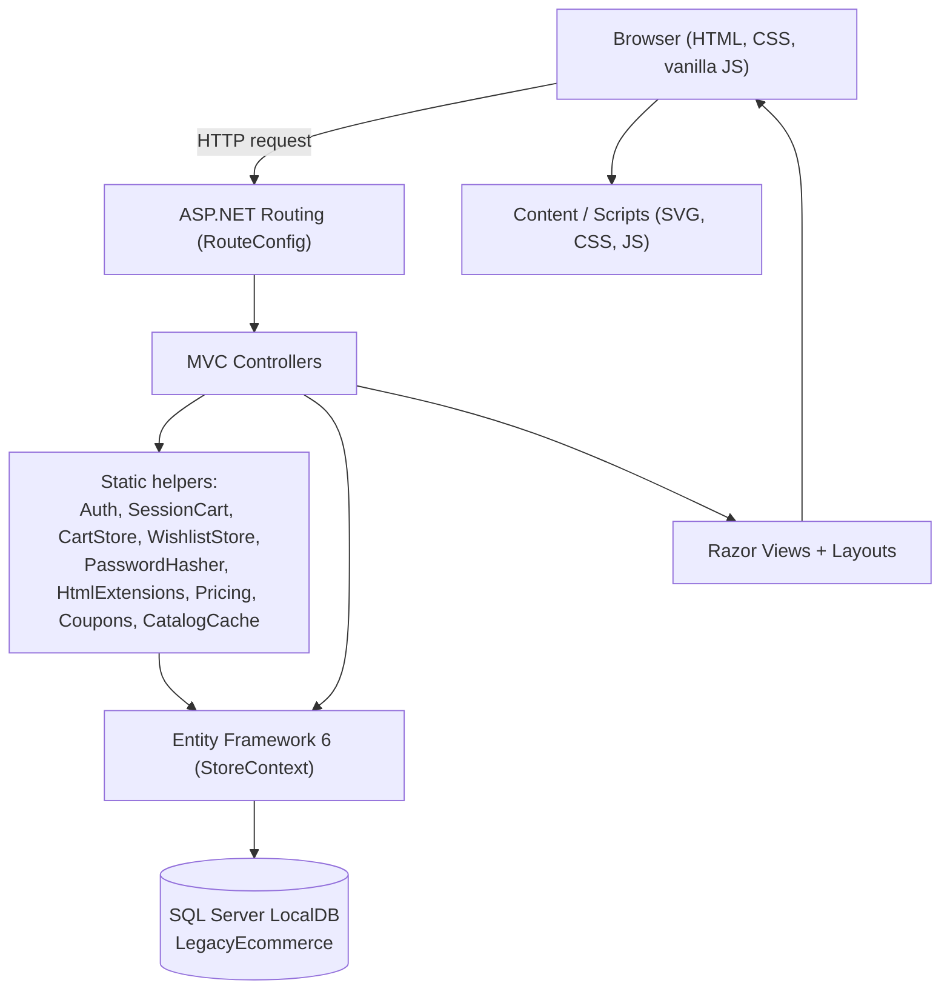
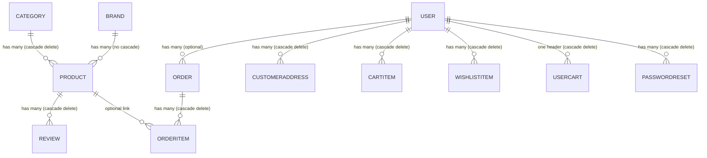

# NovaKart

NovaKart is a legacy **ASP.NET MVC 5** e-commerce web application built on **.NET Framework 4.7** with **Entity Framework 6** and **SQL Server LocalDB**. It is a single-project prototype storefront plus admin back office, written in C# and Razor views.

> This repository is a learning/teaching codebase. The project name in source is `LegacyEcommerce`; the storefront brand shown to customers is "NovaKart". Some behavior is intentionally simplified (mock payments, in-memory catalog cache, session-based authentication).

---

## 1. What this project is

NovaKart simulates an online shop for the Indian market (prices in ₹, GST, UPI/Card/COD payments). It supports:

- Browsing a seeded catalog of ~2,500 products across 12 categories.
- Product detail pages with image gallery, color/size variants, specs and reviews.
- Search, category landing pages, filtering, sorting, infinite scroll and classic paging.
- A session-based cart with coupons, plus a persisted cart for signed-in users.
- A multi-step checkout (Address → Payment → Review → Place Order) and order history.
- A wishlist, product reviews, contact messages and a newsletter list.
- An admin dashboard for products, orders, coupons, customers, messages, newsletter and review moderation.
- SEO helpers: `robots.txt`, `sitemap.xml`, canonical URLs and JSON-LD product markup.

The problem it addresses: it is a complete, runnable example of how a classic MVC5 monolith wires controllers, EF6 entities, Razor views, session state and static JavaScript together, without modern SPA frameworks or a dedicated service/repository layer.

---

## 2. Main features

### Customer features
- Home page with categories, featured products, deals and new arrivals (`HomeController.Index`).
- Catalog browsing by category (`/c/{slug}`), search (`/products?q=`), sort, price/brand/rating filters.
- Product details (`/product/{slug}`) with gallery, variant picker, related products, recently viewed.
- Cart (`/cart`) with quantity controls, coupon codes, free-shipping threshold and AJAX totals.
- Checkout (`/checkout`) in three steps plus a success page.
- Wishlist (`/wishlist`) with AJAX toggle and move-to-wishlist from the cart.
- Account area: order history, order details, printable tax invoice, addresses, edit profile, change password.
- Password reset via a generated token link (displayed on screen; no email is actually sent).
- Contact form and newsletter subscribe/unsubscribe.

### Commerce features
- Pricing engine: 18% GST, ₹49 shipping, free shipping above ₹999 (`Pricing`).
- Coupons: fixed amount, percentage (with cap) and free shipping (`Coupons`, `Coupon`).
- Order lifecycle: `Placed → Packed → Shipped → Delivered` (and `Cancelled`), with stock decrement/restock.
- Review capture with a verified-purchase flag.

### Administration features
- Dashboard: revenue, monthly revenue, counts, low-stock alerts, orders by status.
- Product CRUD with slug/SKU generation and catalog cache refresh.
- Order list/search/filter, order details, status updates.
- Coupon CRUD, customer list with spend metrics, contact message inbox, newsletter management.
- Review moderation (approve/hide/delete).

---

## 3. Technology stack (verified from the repository)

| Technology | Version | Where it appears | Responsibility |
|---|---|---|---|
| .NET Framework | 4.7 (`v4.7`) | `LegacyEcommerce.csproj`, `Web.config` | Runtime target |
| ASP.NET MVC | 5.2.9 | `packages.config`, `Web.config`, `Controllers/` | Routing, controllers, views |
| ASP.NET Razor / WebPages | 3.2.9 | `Views/`, `Views/Web.config` | Razor view engine (`.cshtml`) |
| Entity Framework | 6.4.4 | `packages.config`, `Data/` | ORM mapping to SQL Server |
| SQL Server LocalDB | MSSQLLocalDB | `Web.config` connection string | Local database instance |
| C# | (compiler of VS) | `*.cs` | Server code |
| Vanilla JavaScript | — | `Scripts/*.js` | AJAX cart/wishlist, search suggest, catalog scroll, gallery/tabs |
| CSS | — | `Content/site.css`, `Content/admin.css` | Storefront and admin styling |
| PowerShell | 5.x | `scripts/generate-images.ps1` | Generates deterministic SVG artwork |
| NuGet | — | `packages.config`, `tools/nuget.exe` | Package restore |

There is **no** test project, no TypeScript, no jQuery, no Bootstrap, no bundling/minification, and no dependency-injection container. Verify by listing the repo: see [`knowledge-bytes/01-project-structure.md`](knowledge-bytes/01-project-structure.md).

---

## 4. High-level architecture

NovaKart is a classic **monolithic MVC application**. There is no service or repository layer: controllers talk directly to the EF `StoreContext`, and shared logic lives in static helper classes (mostly under `Infrastructure/`; `Pricing` and `CatalogCache` live in `Models/ViewModels/ViewModels.cs`).



Full architecture details, layer-by-layer explanations and more diagrams are in [`knowledge-bytes/00-project-architecture.md`](knowledge-bytes/00-project-architecture.md).

---

## 5. Project folder structure

```text
ecommerce-legacy/
├── LegacyEcommerce.sln              Visual Studio solution (one project)
├── README.md                        This file
├── .gitignore
├── knowledge-bytes/                 Progressive learning documentation (start here)
├── packages/                        NuGet packages (restored, git-ignored)
├── scripts/
│   └── generate-images.ps1          Generates SVG product/category art
├── tools/
│   └── nuget.exe                    NuGet CLI used for restore
└── src/
    └── LegacyEcommerce/
        ├── App_Start/               RouteConfig, FilterConfig
        ├── Content/                 site.css, admin.css, favicon, images/
        ├── Controllers/             Home, Products, Cart, Checkout, Account,
        │                            Admin, Wishlist, Sitemap, Error
        ├── Data/                    StoreContext, EcommerceInitializer, EcommerceSeeder
        ├── Infrastructure/          Auth, SessionCart, CartStore, WishlistStore,
        │                            PasswordHasher, HtmlExtensions
        ├── Models/                  Entity classes + ViewModels/
        ├── Properties/              AssemblyInfo.cs
        ├── Scripts/                 site.js, catalog.js, cart.js, pdp.js, checkout.js
        ├── Views/                   Razor views + _Layout / _AdminLayout
        ├── Global.asax(.cs)         Application_Start, culture setup
        ├── Web.config               App configuration + connection string
        ├── packages.config          NuGet package list
        └── LegacyEcommerce.csproj   MSBuild project (globs **/*.cs and views)
```

The `.csproj` uses wildcard includes (`<Compile Include="**\*.cs" />`), so new `.cs` files are compiled automatically without editing the project file.

---

## 6. How a request flows

A typical customer request (for example opening a product page) travels like this:

1. **Browser** requests `GET /product/wireless-headphones-example`.
2. **IIS / IIS Express** passes the request to ASP.NET; `Global.asax` `Application_BeginRequest` sets the INR currency culture on the thread.
3. **Routing** (`App_Start/RouteConfig.cs`) matches the `ProductDetails` route to `ProductsController.Details(slug)`.
4. **Controller** (`ProductsController`) queries Entity Framework via `StoreContext`, loads the product, brand, category, related products and approved reviews.
5. **Infrastructure helpers** may participate (for example `CatalogCache`, `Auth`, `SessionCart`).
6. **EF6** issues SQL to **SQL Server LocalDB** and materializes entities.
7. The controller returns a **Razor view** (`Views/Products/Details.cshtml`), which calls the shared `_Layout.cshtml` and partials (`_ProductCard`, `_RecentlyViewed`).
8. The rendered HTML returns to the browser; `Scripts/pdp.js` adds gallery and tab behavior.

The full lifecycle (application start, culture, error handling, routing) is documented in [`knowledge-bytes/02-application-startup-and-request-flow.md`](knowledge-bytes/02-application-startup-and-request-flow.md).

---

## 7. Database overview

Database: **SQL Server LocalDB**, catalog `LegacyEcommerce`, connection string name `StoreContext` defined in `Web.config`.

Entities (`Data/StoreContext.cs`), key relationships (from `OnModelCreating`):



The database is **created and seeded automatically** on first run by `Data/EcommerceInitializer.cs`. Details, indexes, seeding volumes and risks are in [`knowledge-bytes/03-data-layer-and-database.md`](knowledge-bytes/03-data-layer-and-database.md).

> Do not run the app against a production database. The initializer creates tables and seeds data when the database is missing or empty.

---

## 8. Prerequisites

- **Windows** (this is .NET Framework; it does not run on Linux/macOS).
- **Visual Studio 2019 or 2022** with the **ASP.NET and web development** workload, or MSBuild + IIS Express.
- **.NET Framework 4.7** (Developer Pack / targeting pack).
- **SQL Server Express LocalDB** (MSSQLLocalDB), included with Visual Studio.
- **NuGet** (either VS-integrated or `tools/nuget.exe`).

No Node.js, npm, Docker or database server install is required beyond LocalDB.

---

## 9. Local development setup

1. Clone the repository (from a place outside the original machine paths shown here).
2. Restore NuGet packages. If your Visual Studio does not restore automatically:
   ```powershell
   # Run from the repo root; tools\nuget.exe ships with the repo
   & .\tools\nuget.exe restore .\LegacyEcommerce.sln
   ```
3. Open `LegacyEcommerce.sln` in Visual Studio.
4. Build the solution (**Build → Build Solution**).
5. Ensure the startup project is `LegacyEcommerce`.
6. Press **F5** (or Ctrl+F5) to run. Visual Studio launches **IIS Express** and opens the site (typically on a `http://localhost:<port>/` URL shown in the browser bar).

> IIS Express and LocalDB run without Administrator rights. Binding a site in full IIS or creating the LocalDB instance for "All Users" may require Administrator permissions (see [`knowledge-bytes/19-iis-deployment-and-troubleshooting.md`](knowledge-bytes/19-iis-deployment-and-troubleshooting.md)).

---

## 10. Database configuration and initialization

- Connection string (`src/LegacyEcommerce/Web.config`):
  ```xml
  <add name="StoreContext"
       connectionString="Data Source=(LocalDB)\MSSQLLocalDB;Initial Catalog=LegacyEcommerce;Integrated Security=True;MultipleActiveResultSets=True"
       providerName="System.Data.SqlClient" />
  ```
- On `Application_Start` the app sets `Database.SetInitializer(new EcommerceInitializer())` and calls `db.Database.Initialize(false)`.
- `EcommerceInitializer.InitializeDatabase` will: create the database if it does not exist, seed it, run `EnsureCoreTables` (adds later-added tables via guarded raw SQL), and create indexes. If the database exists but has no products, it re-seeds.
- Seeding creates ~2,500 products, 12 categories, brands, reviews, 9 users and 60 orders using a **fixed random seed** for reproducibility.

> The initializer never drops the database, but it *creates* and *seeds* one. Point the connection at a disposable LocalDB, not at shared data.

To force a clean re-seed during development, delete the LocalDB database named `LegacyEcommerce` (for example via SQL Server Object Explorer) and run the app again. **Do not** do this against any database you care about.

---

## 11. Running the application

- The intended environment is **Visual Studio 2019/2022 + IIS Express + SQL Server LocalDB**.
- There is no `dotnet run`, no npm script and no CLI launch command for this project. Launch it from Visual Studio (or publish to IIS; see section 16).
- Currency culture is forced to INR in `Global.asax.cs` (`Application_BeginRequest`); the config `globalization` is `en-IN`.

---

## 12. Key URLs

| Area | URL | Controller action |
|---|---|---|
| Home | `/` or `/home/index` | `HomeController.Index` |
| All products | `/products` | `ProductsController.Index` |
| Category | `/c/{slug}` | `ProductsController.Index` |
| Product details | `/product/{slug}` | `ProductsController.Details` |
| Search | `/products?q=term` | `ProductsController.Index` |
| Cart | `/cart` | `CartController.Index` |
| Checkout | `/checkout` | `CheckoutController.Index` |
| Checkout success | `/checkout/success/{id}` | `CheckoutController.Success` |
| Wishlist | `/wishlist` | `WishlistController.Index` |
| Sign in / register | `/account/login`, `/account/register` | `AccountController` |
| My account | `/account` | `AccountController.Index` |
| Admin dashboard | `/admin` → `/admin/dashboard` | `AdminController.Dashboard` |
| robots / sitemap | `/robots.txt`, `/sitemap.xml` | `SitemapController` |
| Error pages | `/error`, `/error/notfound`, `/error/forbidden` | `ErrorController` |

---

## 13. Testing and verification

There is **no automated test project** in this repository (verified). Verification is manual:

- Build with no errors, then click through the golden path: Home → category → product → add to cart → checkout → place order → view order/invoice.
- Sign in with a seeded account (demo credentials are shown on the Sign In page) and verify cart/wishlist merge.
- Sign in as the seeded admin and exercise product/order/coupon/review management.
- Check `GET /products/suggest?q=phone`, `GET /sitemap.xml` and `GET /robots.txt`.

See [`knowledge-bytes/18-testing-and-verification.md`](knowledge-bytes/18-testing-and-verification.md) for a full manual checklist.

---

## 14. Deployment overview

- **Local deployment (verified by config):** the project is configured for **IIS Express** (`UseIISExpress=true`) and LocalDB. This is the intended way to run it.
- **Full IIS / public hosting (follow with caution):** publish the project (VS **Publish** or `MSBuild` with the web application targets), create an IIS **site** with an **application pool**, and ensure the application-pool identity can reach the database. Because the app uses **Integrated Security** LocalDB, the pool identity must be able to open the LocalDB instance/files, or you must change the connection string to a SQL login.
- The app sets `customErrors mode="RemoteOnly"`, so detailed errors appear locally but are hidden remotely.
- No real payment gateway or email provider is configured. Payments are mocked; password-reset links are displayed on screen instead of emailed.

Deployment mechanics, application-pool identity, permissions and HTTP 500 / SQL login troubleshooting are in [`knowledge-bytes/19-iis-deployment-and-troubleshooting.md`](knowledge-bytes/19-iis-deployment-and-troubleshooting.md).

---

## 15. Security considerations and warnings

Documented from actual source; treat as a learning/legacy codebase, not production-ready:

- **Authentication is session-based**, not ASP.NET Identity/Forms auth. `Web.config` sets `<authentication mode="None" />`. The signed-in user is a `SessionUser` stored in `Session["NK.User"]` via `Infrastructure/Auth.cs`.
- **Passwords** are hashed with PBKDF2 (`Rfc2898DeriveBytes`, 120,000 iterations, 32-byte output, per-user 16-byte salt) in `Infrastructure/PasswordHasher.cs`. This is a sound choice; the surrounding auth/session model is the weaker part.
- **Antiforgery tokens** (`@Html.AntiForgeryToken()` + `[ValidateAntiForgeryToken]`) protect form POSTs in Account, Checkout, Admin, Home Contact/Newsletter. The **AJAX JSON endpoints** in `CartController` and `WishlistController` do **not** validate antiforgery tokens.
- **Error messages** can contain exception detail (for example `AdminController` surfaces `ex.Message` on product save failures). `customErrors` is `RemoteOnly`.
- **Secrets:** no API keys or external secrets exist in the repo. The LocalDB connection uses Integrated Security, so there is no password in source. Treat the demo admin account as public knowledge and change it before exposing the app.
- **Prices/stock** are recalculated on the server at order time, but the mock payment step accepts any 16-digit card number and never charges anything.

Full discussion: [`knowledge-bytes/16-validation-security-and-error-handling.md`](knowledge-bytes/16-validation-security-and-error-handling.md).

---

## 16. Knowledge Bytes

Detailed, progressive learning material lives in [`knowledge-bytes/`](knowledge-bytes/README.md). Start with the index, then read in order.

- [00 - Project Architecture](knowledge-bytes/00-project-architecture.md)
- [01 - Project Structure](knowledge-bytes/01-project-structure.md)
- [02 - Application Startup & Request Flow](knowledge-bytes/02-application-startup-and-request-flow.md)
- [03 - Data Layer & Database](knowledge-bytes/03-data-layer-and-database.md)
- [04 - Models & ViewModels](knowledge-bytes/04-models-and-viewmodels.md)
- [05 - Product Catalog](knowledge-bytes/05-product-catalog.md)
- [06 - Product Details & Variants](knowledge-bytes/06-product-details-and-variants.md)
- [07 - Search, Filtering, Sorting & Pagination](knowledge-bytes/07-search-filtering-sorting-pagination.md)
- [08 - Cart & Session Management](knowledge-bytes/08-cart-and-session-management.md)
- [09 - Checkout & Coupons](knowledge-bytes/09-checkout-and-coupons.md)
- [10 - Authentication & Authorization](knowledge-bytes/10-authentication-and-authorization.md)
- [11 - Orders & Order History](knowledge-bytes/11-orders-and-order-history.md)
- [12 - Wishlist](knowledge-bytes/12-wishlist.md)
- [13 - Reviews & Moderation](knowledge-bytes/13-reviews-and-moderation.md)
- [14 - Admin Dashboard & Management](knowledge-bytes/14-admin-dashboard-and-management.md)
- [15 - Frontend: Views, JavaScript & CSS](knowledge-bytes/15-frontend-views-javascript-css.md)
- [16 - Validation, Security & Error Handling](knowledge-bytes/16-validation-security-and-error-handling.md)
- [17 - Contact, Newsletter & Static Pages](knowledge-bytes/17-contact-newsletter-and-static-pages.md)
- [18 - Testing & Verification](knowledge-bytes/18-testing-and-verification.md)
- [19 - IIS Deployment & Troubleshooting](knowledge-bytes/19-iis-deployment-and-troubleshooting.md)

---

## 17. Known limitations and troubleshooting

Known limitations (observed in source, not assumptions):

- **No automated tests.** Everything is manual.
- **`CatalogCache` holds the entire product table in static memory** and is refreshed only on admin product edits and review posts. It can become stale and is not safe across multiple processes/servers.
- **`HomeController.AnnouncementBar`** returns `PartialView("_AnnouncementBar")`, but no `_AnnouncementBar.cshtml` view exists. The action appears unused; calling it would throw. (The promo content is instead rendered inline in `_Layout.cshtml`.)
- **In-memory filtering.** `ProductsController` filters/sorts the full cached catalog in memory rather than in SQL, which does not scale.
- **Password reset** generates a token and *displays the link on the page*; no email is sent.
- **Payments are mocked.** Any 16-digit card is accepted; nothing is charged.
- **Guest carts** live only in session; they are not persisted unless the user is signed in.
- **Static demo admin credentials** are shown on the Sign In page; change them before any real use.

Common issues:

| Symptom | Likely cause | Where to look |
|---|---|---|
| HTTP 500 with stack trace locally | Unhandled exception; `RemoteOnly` shows details locally | `_Layout`, event log; KB [16](knowledge-bytes/16-validation-security-and-error-handling.md) |
| Blank/empty catalog | Database not seeded or cache not refreshed | KB [03](knowledge-bytes/03-data-layer-and-database.md), `CatalogCache.RefreshProducts()` |
| "Cannot open database" / SQL login error | LocalDB missing or pool identity lacks access | KB [19](knowledge-bytes/19-iis-deployment-and-troubleshooting.md) |
| Products show one data state | Stale `CatalogCache` | KB [14](knowledge-bytes/14-admin-dashboard-and-management.md) |
| Antiforgery error on a form POST | Missing token or expired session | KB [16](knowledge-bytes/16-validation-security-and-error-handling.md) |

---

## 18. Suggested learning order

1. [`knowledge-bytes/00-project-architecture.md`](knowledge-bytes/00-project-architecture.md) — the big picture and diagrams.
2. [`knowledge-bytes/02-application-startup-and-request-flow.md`](knowledge-bytes/02-application-startup-and-request-flow.md) — how the app boots and routes.
3. [`knowledge-bytes/03-data-layer-and-database.md`](knowledge-bytes/03-data-layer-and-database.md) and [`04`](knowledge-bytes/04-models-and-viewmodels.md) — the data model.
4. [`05`](knowledge-bytes/05-product-catalog.md) → [`06`](knowledge-bytes/06-product-details-and-variants.md) → [`07`](knowledge-bytes/07-search-filtering-sorting-pagination.md) — browse the catalog.
5. [`08`](knowledge-bytes/08-cart-and-session-management.md) → [`09`](knowledge-bytes/09-checkout-and-coupons.md) → [`11`](knowledge-bytes/11-orders-and-order-history.md) — the shopping flow.
6. [`10`](knowledge-bytes/10-authentication-and-authorization.md) — auth and roles.
7. [`14`](knowledge-bytes/14-admin-dashboard-and-management.md) — administration.
8. [`15`](knowledge-bytes/15-frontend-views-javascript-css.md) and [`16`](knowledge-bytes/16-validation-security-and-error-handling.md) — frontend and security.

---

*Documentation generated by inspecting the repository at commit `d6fe96a`. Every code reference is grounded in files in `src/LegacyEcommerce/`. Where a feature could not be verified, the limitation is called out explicitly.*
