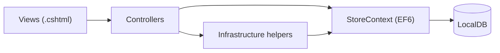

# 00 - Project Architecture

**Goal of this topic:** see the whole system before diving into details: what kind of application this is, how the code is layered, how a request travels through it, and which architectural choices carry risk.

---

### Byte 00: What kind of application this is

**Builds on:** nothing (start here).
**Source file(s):** `src/LegacyEcommerce/LegacyEcommerce.csproj`, `Web.config`, `Global.asax.cs`

**In plain terms:** It is one traditional "monolith" website — a single project where HTML pages, server logic and database code all live together and run on Windows.

**The code:**

```xml
<!-- Web.config -->
<compilation debug="true" targetFramework="4.7">
...
<authentication mode="None" />
```

**What's happening:**
- The project targets **.NET Framework 4.7** and uses **ASP.NET MVC 5** (classic, Windows-only).
- There is **no** front-end framework (no React/Angular), **no** Web API project, **no** service layer and **no** dependency-injection container.
- The browser gets server-rendered **Razor** HTML; JavaScript is only used to enhance pages (AJAX cart, search suggest, gallery).
- Everything — storefront and admin — is in the single assembly `LegacyEcommerce`.

**Why it matters:** Understanding this shape prevents you from looking for abstractions that do not exist. Business logic is spread across controllers and static `Infrastructure` helpers, so that is where you look.

**Trace it further:** [01 - Project Structure](01-project-structure.md), [02 - Application Startup & Request Flow](02-application-startup-and-request-flow.md).

---

### Byte 01: The layers and who talks to whom

**Builds on:** Byte 00.
**Source file(s):** `Controllers/`, `Data/StoreContext.cs`, `Infrastructure/`, `Models/`, `Views/`

**In plain terms:** Controllers are the front desk; Entity Framework is the warehouse; the small `Infrastructure` helpers are shared utilities everyone borrows.

**The code:**

```csharp
// Controllers/HomeController.cs — a controller talks to EF and helpers directly
private readonly StoreContext db = new StoreContext();
public ActionResult Index()
{
    var featured = db.Products.Where(p => p.IsFeatured)
        .OrderByDescending(p => p.SoldCount).Take(8).ToList();
    var categories = CatalogCache.Categories;   // static helper
    ...
}
```

**What's happening (dependency direction):**
- **Views → Controllers:** a Razor view is rendered by exactly one controller action.
- **Controllers → Infrastructure helpers:** controllers call static classes like `Pricing`, `SessionCart`, `CatalogCache`, `Auth`.
- **Controllers → EF (`StoreContext`):** controllers create/use `StoreContext` to run queries.
- **Infrastructure → EF:** helpers such as `CartStore` and `WishlistStore` also use `StoreContext`.
- **Nobody → Controllers:** helpers never call back into controllers.



**Why it matters:** Because helpers are static and hold no per-request state, most of them take the current `HttpContext`/`Session` as an argument or read it from `HttpContext.Current`. That is why you see methods like `SessionCart.Add(httpContext, productId, qty)`.

**Trace it further:** [04 - Models & ViewModels](04-models-and-viewmodels.md), [08 - Cart & Session Management](08-cart-and-session-management.md).

---

### Byte 02: The application startup path

**Builds on:** Byte 01.
**Source file(s):** `Global.asax.cs`, `App_Start/RouteConfig.cs`, `App_Start/FilterConfig.cs`

**In plain terms:** When IIS starts the site, one method runs everything needed before the first page is served.

**The code:**

```csharp
// Global.asax.cs
protected void Application_Start()
{
    AreaRegistration.RegisterAllAreas();
    FilterConfig.RegisterGlobalFilters(GlobalFilters.Filters);
    RouteConfig.RegisterRoutes(RouteTable.Routes);
    Database.SetInitializer(new EcommerceInitializer());
    using (var db = new StoreContext())
    {
        db.Database.Initialize(false);
        var warm = db.Products.Count();
        EcommerceInitializer.EnsureDefaultCoupons(db);
    }
    // warm the static cache by touching its getters
    var cats = CatalogCache.Categories;
    var prods = CatalogCache.Products;
    ...
}
```

**What's happening:**
- **Areas, filters, routes** are registered in a fixed order.
- **EF initializer** (`EcommerceInitializer`) is attached and told to initialize the database.
- **`CatalogCache`** is warmed with the full product list so the first visitor does not wait for a cold query.
- **`Application_BeginRequest`** (not shown) then sets the INR currency culture on every request thread.

**Why it matters:** This single method is the source of the app's runtime setup — database creation/seeding, routing, error handling, and cache warming. If the app "hangs" on first start, it is usually seeding here.

**Trace it further:** [02 - Application Startup & Request Flow](02-application-startup-and-request-flow.md), [03 - Data Layer & Database](03-data-layer-and-database.md).

---

### Byte 03: The request lifecycle

**Builds on:** Byte 02.
**Source file(s):** `Global.asax.cs`, `App_Start/RouteConfig.cs`, `Controllers/ProductsController.cs`, `Views/Products/Details.cshtml`

**In plain terms:** A URL turns into a controller method, which returns HTML built by a view.

**The code:**

```csharp
// App_Start/RouteConfig.cs
routes.MapRoute("ProductDetails", "product/{slug}",
    new { controller = "Products", action = "Details" });
```

**What's happening for `GET /product/wireless-headphones-example`:**
1. **IIS** hands the request to ASP.NET.
2. **`Application_BeginRequest`** sets `en-IN` currency formatting.
3. **Routing** matches `product/{slug}` → `ProductsController.Details`.
4. **Controller action** runs: queries EF, records "recently viewed", builds a view model.
5. **Razor view** renders using the shared **`_Layout.cshtml`** and partials such as `_ProductCard`.
6. **HTML + CSS + JS** are sent to the browser; `pdp.js` wires up the gallery.

**Why it matters:** This is the template for every page. Once you can follow one route end-to-end, you can follow them all.

**Trace it further:** [06 - Product Details & Variants](06-product-details-and-variants.md).

---

### Byte 04: Where "business rules" actually live

**Builds on:** Byte 01.
**Source file(s):** `Models/ViewModels/ViewModels.cs` (`Pricing`), `Infrastructure/SessionCart.cs` (`Coupons`), `Controllers/CheckoutController.cs`

**In plain terms:** There is no "business layer" folder; the rules are in static helper classes plus controller code.

**The code:**

```csharp
// Models/ViewModels/ViewModels.cs — the Pricing helper (values verified in source)
public const decimal FreeShippingThreshold = 999m;
public const decimal ShippingFee = 49m;
public const decimal TaxRate = 0.18m; // 18% GST
```

**What's happening:**
- **Pricing** rules (GST, shipping, free-shipping threshold) are constants/methods in the `Pricing` static class.
- **Coupon** evaluation lives in the `Coupons` static class (in `SessionCart.cs`) plus the `Coupon` entity.
- **Order totals** are computed in `CheckoutController` by calling `Pricing.Compute`.
- **Catalog filtering/sorting** is partly in `ProductsController`, partly in the `CatalogCache` static class.

**Why it matters:** When you need to change a rule (for example the free-shipping threshold), you usually change one constant in `Infrastructure` — but you must also check whether the view or JavaScript duplicates that number. JavaScript receives values from the server (`window.Nova`), which reduces duplication.

**Trace it further:** [09 - Checkout & Coupons](09-checkout-and-coupons.md), [15 - Frontend: Views, JavaScript & CSS](15-frontend-views-javascript-css.md).

---

### Byte 05: Two kinds of state — database and session

**Builds on:** Byte 01.
**Source file(s):** `Web.config` (`sessionState`), `Infrastructure/SessionCart.cs`, `Infrastructure/Auth.cs`, `Data/StoreContext.cs`

**In plain terms:** Permanent things (orders, products, users) live in the database; temporary things (guest cart, who is logged in) live in server session memory.

**The code:**

```xml
<!-- Web.config -->
<sessionState mode="InProc" cookieless="false" timeout="240" />
```

**What's happening:**
- **InProc** session means session data is stored **in the IIS/IIS Express worker process memory**, not in the database.
- **`SessionCart`** stores the guest cart under `Session["NK.Cart"]` and the coupon under `Session["NK.Coupon"]`.
- **`Auth`** stores the signed-in user under `Session["NK.User"]`.
- **`CartStore`** and **`WishlistStore`** persist data to the database for **signed-in** users.

**Why it matters:** InProc session is lost when the app pool recycles or the server restarts, and it does not work across multiple servers. That is acceptable for a demo but a real limitation. It also explains why an anonymous cart can vanish after a restart.

**Trace it further:** [08 - Cart & Session Management](08-cart-and-session-management.md), [10 - Authentication & Authorization](10-authentication-and-authorization.md).

---

### Byte 06: The catalog cache — a deliberate shortcut

**Builds on:** Byte 04, Byte 05.
**Source file(s):** `Models/ViewModels/ViewModels.cs` (`CatalogCache`), `Controllers/ProductsController.cs`, `Controllers/AdminController.cs`

**In plain terms:** The app keeps every product in a static in-memory list so browsing is fast, and refreshes that list when products change.

**The code:**

```csharp
// Models/ViewModels/ViewModels.cs — the CatalogCache helper
public static List<Product> Products
{
    get { if (_products == null) RefreshProducts(); return _products; }
}
public static void RefreshProducts()
{
    using (var db = new Data.StoreContext())
        _products = db.Products.Include("Brand").Include("Category").OrderBy(p => p.Id).ToList();
}
```

**What's happening:**
- On startup (and after admin product edits / review posts) the cache is refilled from the database.
- `ProductsController` then filters, searches and sorts **in memory** over this list instead of issuing SQL `WHERE`/`ORDER BY`.
- The cache is `static`, so it is shared by all requests in the process.

**Why it matters (risk):** This makes read queries trivial to write but does not scale: the whole table is loaded into memory, filtering is CPU-bound, and the cache can go **stale** or diverge between processes. It is the single most important architectural shortcut to understand.

**Trace it further:** [05 - Product Catalog](05-product-catalog.md), [07 - Search, Filtering, Sorting & Pagination](07-search-filtering-sorting-pagination.md), [14 - Admin Dashboard & Management](14-admin-dashboard-and-management.md).

---

### Byte 07: The admin area is just more controllers

**Builds on:** Byte 03.
**Source file(s):** `Controllers/AdminController.cs`, `Views/Admin/_AdminLayout.cshtml`, `Infrastructure/Auth.cs`

**In plain terms:** Admin pages are ordinary MVC pages protected by an attribute and using a different layout.

**The code:**

```csharp
// Controllers/AdminController.cs
[RequireAdmin]
public class AdminController : Controller { ... }
```

**What's happening:**
- `[RequireAdmin]` (a custom action filter from `Infrastructure/Auth.cs`) checks the session user's role.
- Anonymous users are redirected to login; signed-in users without the `Admin` role are redirected to the home page (`~/`).
- `Views/Admin/` uses `_AdminLayout.cshtml` instead of the storefront layout.

**Why it matters:** Authorization is attribute-based and session-based, not framework identity. You can read the entire security model in `Auth.cs`.

**Trace it further:** [10 - Authentication & Authorization](10-authentication-and-authorization.md), [14 - Admin Dashboard & Management](14-admin-dashboard-and-management.md).

---

### Byte 08: Architectural strengths and weaknesses at a glance

**Builds on:** Bytes 00–07.
**Source file(s):** whole repository

**In plain terms:** It is a clean, readable learning monolith with some shortcuts that would need work for scale.

**What's happening:**

**Strengths**
- Small, consistent patterns: one controller per area, static helpers, clear file layout.
- Good password hashing (PBKDF2, 120k iterations).
- Antiforgery tokens on form POSTs.
- Server-side recalculated totals (the client cannot dictate the final price).
- SEO basics (`robots.txt`, `sitemap.xml`, canonical URLs, JSON-LD).

**Weaknesses (verified)**
- No automated tests.
- `CatalogCache` loads the entire product table into static memory; filtering is in-memory.
- Session-based auth (`<authentication mode="None" />`) with InProc session (not durable, not multi-server).
- AJAX cart/wishlist JSON endpoints lack antiforgery validation.
- Some endpoints surface raw exception messages.
- Payments are mocked; no email is sent.
- `HomeController.AnnouncementBar` references a missing `_AnnouncementBar.cshtml` view (appears unused).

**Why it matters:** These are the exact areas to discuss if you extend the project or migrate it. Each is expanded in later topics, especially [16](16-validation-security-and-error-handling.md).

**Trace it further:** [16 - Validation, Security & Error Handling](16-validation-security-and-error-handling.md), [18 - Testing & Verification](18-testing-and-verification.md).

---

**Next topic →** [01 - Project Structure](01-project-structure.md)
