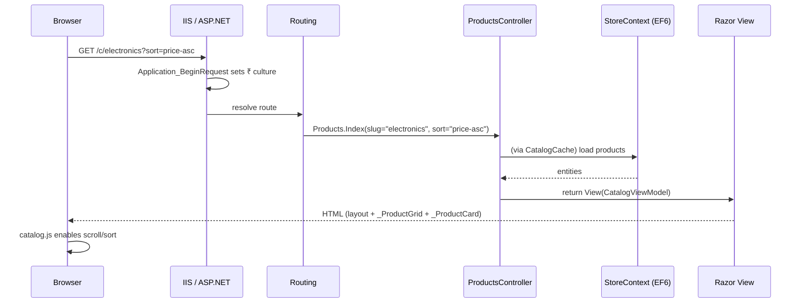

# 02 - Application Startup & Request Flow

**Goal of this topic:** understand what happens from the moment IIS starts the site to the moment a page is rendered.

---

### Byte 15: `Application_Start` — the boot sequence

**Builds on:** [00 - Project Architecture](00-project-architecture.md), [01 - Project Structure](01-project-structure.md).
**Source file(s):** `Global.asax.cs:15`

**In plain terms:** One method runs once when the site starts and sets up everything the app needs.

**The code:**

```csharp
// Global.asax.cs:15
protected void Application_Start()
{
    AreaRegistration.RegisterAllAreas();
    FilterConfig.RegisterGlobalFilters(GlobalFilters.Filters);
    RouteConfig.RegisterRoutes(RouteTable.Routes);

    Database.SetInitializer(new EcommerceInitializer());

    using (var db = new StoreContext())
    {
        db.Database.Initialize(false);
        var warm = db.Products.Count();
        EcommerceInitializer.EnsureDefaultCoupons(db);
    }

    var cats = CatalogCache.Categories;
    var brands = CatalogCache.Brands;
    var prods = CatalogCache.Products;
    var pf = CatalogCache.PriceFloor;
    var pc = CatalogCache.PriceCeil;
}
```

**What's happening, in order:**
1. **Areas / filters / routes** are registered (this app has no areas, but the call is standard).
2. `Database.SetInitializer(new EcommerceInitializer())` attaches the custom EF initializer.
3. `db.Database.Initialize(false)` triggers the initializer (create/seed if needed).
4. `db.Products.Count()` forces a real query (warms EF).
5. `EnsureDefaultCoupons` seeds the three stock coupons if none exist.
6. The last five lines force `CatalogCache` to load categories, brands, products and price bounds into memory.

**Why it matters:** This is the *only* place global setup runs. The multi-second delay on first start is usually database creation + seeding here. If coupons or the catalog appear empty, this method is where to look.

**Trace it further:** [03 - Data Layer & Database](03-data-layer-and-database.md).

---

### Byte 16: `Application_BeginRequest` — forcing the rupee culture

**Builds on:** Byte 15.
**Source file(s):** `Global.asax.cs:37`

**In plain terms:** On every request, the app sets the thread's culture so prices format as Indian rupees.

**The code:**

```csharp
// Global.asax.cs:37
protected void Application_BeginRequest()
{
    var culture = (CultureInfo)CultureInfo.InvariantCulture.Clone();
    culture.NumberFormat.CurrencySymbol = "\u20B9";          // ₹
    culture.NumberFormat.CurrencyPositivePattern = 0;
    culture.NumberFormat.NumberGroupSizes = new[] { 3, 2, 3 }; // Indian grouping
    Thread.CurrentThread.CurrentCulture = culture;
    Thread.CurrentThread.CurrentUICulture = culture;
}
```

**What's happening:** It clones the invariant culture, sets the currency symbol to `₹` (U+20B9), and applies the Indian grouping pattern `3,2,3` (so 12,34,567 instead of 1,234,567). It then assigns it to the current thread.

**Why it matters:** This is why `@Model.Total.ToString("N0")` renders with comma grouping as expected. Combined with `globalization culture="en-IN"` in `Web.config`, the whole app speaks INR. Note that the app uses `.ToString("N0")` (number) plus a literal `₹` in most places, rather than `.ToString("C")` (currency).

**Trace it further:** [04 - Models & ViewModels](04-models-and-viewmodels.md) (`Pricing`).

---

### Byte 17: Routes — URLs to controllers

**Builds on:** Byte 15.
**Source file(s):** `App_Start/RouteConfig.cs:8`

**In plain terms:** A short list of friendly URL patterns decides which controller/action handles a request.

**The code:**

```csharp
// App_Start/RouteConfig.cs
routes.MapRoute("Robots", "robots.txt",
    new { controller = "Sitemap", action = "Robots" });
routes.MapRoute("Sitemap", "sitemap.xml",
    new { controller = "Sitemap", action = "Index" });
routes.MapRoute("ProductDetails", "product/{slug}",
    new { controller = "Products", action = "Details" });
routes.MapRoute("CategoryLanding", "c/{slug}",
    new { controller = "Products", action = "Index" });
routes.MapRoute("OrderSuccess", "checkout/success/{id}",
    new { controller = "Checkout", action = "Success" });
routes.MapRoute("Default", "{controller}/{action}/{id}",
    new { controller = "Home", action = "Index", id = UrlParameter.Optional });
```

**What's happening:** Routes are matched **in order**, top to bottom. The specific SEO routes come first so that `/product/...` and `/c/...` win. The `Default` catch-all maps `/account/login` → `AccountController.Login`, `/admin/dashboard` → `AdminController.Dashboard`, and `/` → `Home/Index`.

**Why it matters:** If you add a new "pretty" URL (for example `/brand/{slug}`), you must add it **above** the `Default` route or it will be swallowed by the catch-all.

**Trace it further:** [05 - Product Catalog](05-product-catalog.md), [17 - Contact, Newsletter & Static Pages](17-contact-newsletter-and-static-pages.md).

---

### Byte 18: Global filter — `HandleError`

**Builds on:** Byte 15.
**Source file(s):** `App_Start/FilterConfig.cs:7`, `Web.config:28`

**In plain terms:** One global filter catches unhandled exceptions and shows the friendly error page.

**The code:**

```csharp
// App_Start/FilterConfig.cs
public static void RegisterGlobalFilters(GlobalFilterCollection filters)
{
    filters.Add(new HandleErrorAttribute());
}
```

**What's happening:** `HandleErrorAttribute` is the MVC global exception filter. Its default behavior is to render a view named `Error` for the failing controller, looking in `~/Views/{Controller}/Error.cshtml` and then `~/Views/Shared/Error.cshtml`. In this project those files do **not** exist (the only error views are `Views/Error/Error.cshtml`, `NotFound.cshtml` and `Forbidden.cshtml`, used explicitly by `ErrorController`). So in practice an unhandled exception is not rendered by `HandleErrorAttribute`; it falls through to the `customErrors` redirect below.

```xml
<!-- Web.config -->
<customErrors mode="RemoteOnly">
  <error statusCode="404" redirect="~/error/notfound" />
  <error statusCode="500" redirect="~/error/index" />
</customErrors>
```

`customErrors` redirects 404s to `ErrorController.NotFound` and 500s to `ErrorController.Index`. Because the mode is `RemoteOnly`, local users see full ASP.NET error details while remote users are redirected.

**Why it matters:** Exception handling here is effectively driven by `customErrors` + `ErrorController`, not by `HandleErrorAttribute`. `ErrorController` sets `Response.StatusCode` and `TrySkipIisCustomErrors = true` so the correct HTTP status survives. If you want `HandleErrorAttribute` to work, you would add a `Views/Shared/Error.cshtml`.

**Trace it further:** [16 - Validation, Security & Error Handling](16-validation-security-and-error-handling.md).

---

### Byte 19: The full request pipeline, end to end

**Builds on:** Bytes 15–18.
**Source file(s):** `Global.asax.cs`, `App_Start/RouteConfig.cs`, `Controllers/`, `Views/`

**In plain terms:** Follow one page request from browser to HTML.

**The sequence for `GET /c/electronics?sort=price-asc`:**



**What's happening:**
1. `Application_BeginRequest` sets the culture.
2. Routing matches `c/{slug}` → `Products.Index`.
3. The controller builds a `CatalogViewModel` (see [07](07-search-filtering-sorting-pagination.md)).
4. The view renders the shared layout, then `_ProductGrid` and `_ProductCard` partials.
5. `catalog.js` runs in the browser to handle sorting, paging and infinite scroll.

**Why it matters:** This single diagram covers almost every page in the app. Each later topic zooms into one stage (data, catalog, cart, checkout, etc.).

**Trace it further:** [05 - Product Catalog](05-product-catalog.md).

---

**Next topic →** [03 - Data Layer & Database](03-data-layer-and-database.md)
